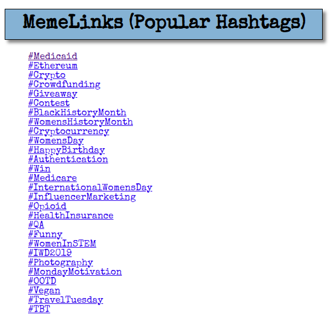

# memelinks

- Flask app which displays Twitter hashtag link list in browser.
- Python 3, Flask, Jinja



## Tested Using...

- Linux 5.3.0
- Ubuntu 19.10 (Eoan Ermine)
- Python 3.7.5
- GNOME Shell 3.34.3

## Virtual Environment

A Python virtual environment helps prevent changes to _system Python_ which would render an OS unstable. For example, if a Python module requires a previous version of a dependency, which _system Python_ also uses, and then changes such an existing dependency to another version, system instability can result. So, a Python virtual environment can help contain Python development within its own sandbox to help prevent it from knocking the swing set over or tilting the merry-go-round. For developers, virtual environments can become a system security measure of sorts.

Below, is an example of virtual environment creation:

```shell
user_foo@foo_host:~/Desktop$ python3 -m venv foo
user_foo@foo_host:~/Desktop$ cd foo
user_foo@foo_host:~/Desktop/foo$ ls -l
total 20
drwxrwxr-x 2 user_foo user_foo 4096 Jul  1 10:11 bin
drwxrwxr-x 2 user_foo user_foo 4096 Jul  1 09:30 include
drwxrwxr-x 3 user_foo user_foo 4096 Jul  1 09:30 lib
lrwxrwxrwx 1 user_foo user_foo    3 Jul  1 09:30 lib64 -> lib
-rw-rw-r-- 1 user_foo user_foo   69 Jul  1 10:10 pyvenv.cfg
drwxrwxr-x 3 user_foo user_foo 4096 Jul  1 10:10 share
$ source bin/activate
(foo) user_foo@foo_host:~/Desktop/foo$
```

## Run the App

From the app's root directory, enter the following args in a Unix-like terminal emulator:

```bash
$ . flask_run.sh
```

`$ . flask_run.sh` is the same as `$ source flask_run.sh`.

Then open `http://127.0.0.1:5000/popular` or `http://127.0.0.1:5000/crypto` in a web browser.

Permissions may need to be adjusted.

## Exports

```bash
export FLASK_ENV=development
export FLASK_APP=memelinks.py
flask run
```

- `export FLASK_ENV=development` tells Flask to run the app in **development mode** which includes a **reloader** and a **debugger**.
- `export FLASK_APP=memelinks` tells Flask which app to run.
- `flask run` starts the app.

## Shebang Line

```bash
#! /bin/bash
```

>When a text file with a [shebang](https://en.wikipedia.org/wiki/Shebang_(Unix)) is used as if it is an executable in a [Unix-like](https://en.wikipedia.org/wiki/Unix-like) operating system, the [program loader](https://en.wikipedia.org/wiki/Loader_(computing)) mechanism parses the rest of the file's initial line as an [interpreter directive](https://en.wikipedia.org/wiki/Interpreter_directive). The loader [executes](https://linux.die.net/man/2/execve) the specified [interpreter](https://en.wikipedia.org/wiki/Interpreter_(computing)) program, passing to it as an argument the path that was initially used when attempting to run the script, so that the program may use the file as input data.

In other words, after the **shebang** (`#!`), the program loader parses the **interpreter directive** (`/bin/python3`) as a Unix argument.

## Imports

```python
from flask import Flask
from flask import render_template
```

>Flask is a lightweight [WSGI](https://wsgi.readthedocs.io/) web application framework. It is designed to make getting started quick and easy, with the ability to scale up to complex applications. It began as a simple wrapper around [Werkzeug](https://palletsprojects.com/p/werkzeug) and [Jinja](https://palletsprojects.com/p/jinja) and has become one of the most popular Python web application frameworks.

>[render_template] [Renders a template](https://flask.palletsprojects.com/en/1.1.x/api/#flask.render_template) from the template folder with the given [`hashtags` and `klinks`].

## Variables

```python
APP = Flask(__name__)
```

```python
POP_HASHTAGS = [
  'Medicaid', 'Ethereum', 'Crypto', 'Crowdfunding', 'Giveaway', 'TBT',
  'Contest', 'BlackHistoryMonth', 'WomensHistoryMonth', 'Cryptocurrency',
  'WomensDay', 'HappyBirthday', 'Authentication', 'Win', 'Medicare',
  'InternationalWomensDay', 'InfluencerMarketing', 'Opioid',
  'HealthInsurance', 'QA', 'Funny', 'WomenInSTEM', 'IWD2019',
  'Photography', 'MondayMotivation', 'OOTD', 'Vegan', 'TravelTuesday']
POP_DICT = {}
```

- `APP = Flask(__name__)` initializes the **Flask** instance.
- `POP_HASHTAGS` contains a _list_ of Twitter hashtag strings, which will be passed to the [Jinja](https://jinja.palletsprojects.com/en/2.11.x/) template.
- `POP_DICT` is a [dict](https://docs.python.org/3/tutorial/datastructures.html#dictionaries) populated by the looping structure.

## Method

```python
@APP.route('/')
def memelinks():
    '''Displays list of Twitter hashtag links in browser.'''
    for hashtag in HASHTAGS:
        KLINKS[hashtag] = f'https://twitter.com/search?q=%23{hashtag}&f=live'
    return render_template('template.htm', hashtags=HASHTAGS, klinks=KLINKS)
```

- `memelinks()` is the memelinks module's method which displays a list of Twitter hashtag links in the browser.
- `@APP.route('/')` is a decorator which modifies `memelinks()`, setting its route as the root directory.
- `for` loop iterates through the iterable `HASHTAGS` list, as hashtag strings and URL addresses are appended to the `KLINKS` dictionary as key/value pairs.
- finally, `render_template()` renders `template.htm`, passing it `hashtags` and `klinks` as data.

## Templates

Flask searches for Jinja templates in the `/templates` directory.

```bash
$ ls templates/
crypto.htm  pop.htm
```

## Modify Engagements Campaign

Modify hashtag lists to suit specific [engagements campaigns](https://business.twitter.com/en/help/campaign-setup/create-an-engagements-campaign.html).

## Financial Hashtags

Two looping structures generate the crypto links; one for each prefix involved: `$` and `#`.
